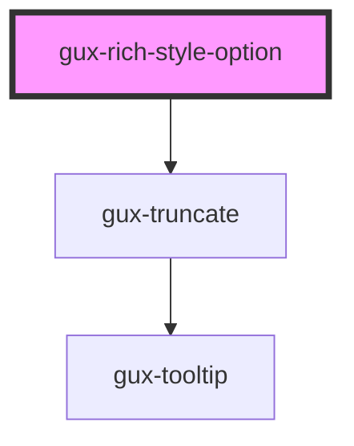

# gux-rich-style-option

<!-- Auto Generated Below -->

## Properties

| Property            | Attribute            | Description | Type                               | Default     |
| ------------------- | -------------------- | ----------- | ---------------------------------- | ----------- |
| `active`            | `active`             |             | `boolean`                          | `false`     |
| `disabled`          | `disabled`           |             | `boolean`                          | `false`     |
| `filtered`          | `filtered`           |             | `boolean`                          | `false`     |
| `selected`          | `selected`           |             | `boolean`                          | `false`     |
| `typographySetting` | `typography-setting` |             | `"1" \| "2" \| "3" \| "paragraph"` | `undefined` |
| `value`             | `value`              |             | `string`                           | `undefined` |

## Slots

| Slot | Description |
| ---- | ----------- |
|      | text        |

## Dependencies

### Depends on

- [gux-truncate](../../../../../stable/gux-truncate)

### Graph

----------------------------------------------

*Built with [StencilJS](https://stenciljs.com/)*
