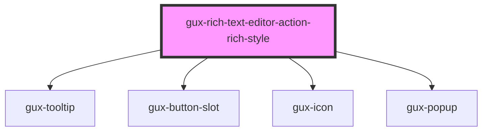

# gux-rich-text-editor-action-rich-style

<!-- Auto Generated Below -->

## Properties

| Property   | Attribute  | Description | Type      | Default |
| ---------- | ---------- | ----------- | --------- | ------- |
| `disabled` | `disabled` |             | `boolean` | `false` |
| `expanded` | `expanded` |             | `boolean` | `false` |

## Slots

| Slot | Description                                               |
| ---- | --------------------------------------------------------- |
|      | for a gux-listbox containing ValidDropdownOption children |

## Dependencies

### Depends on

- [gux-tooltip](../../../../stable/gux-tooltip)
- [gux-button-slot](../../../../stable/gux-button-slot)
- [gux-icon](../../../../stable/gux-icon)
- [gux-popup](../../../../stable/gux-popup)

### Graph

----------------------------------------------

*Built with [StencilJS](https://stenciljs.com/)*
