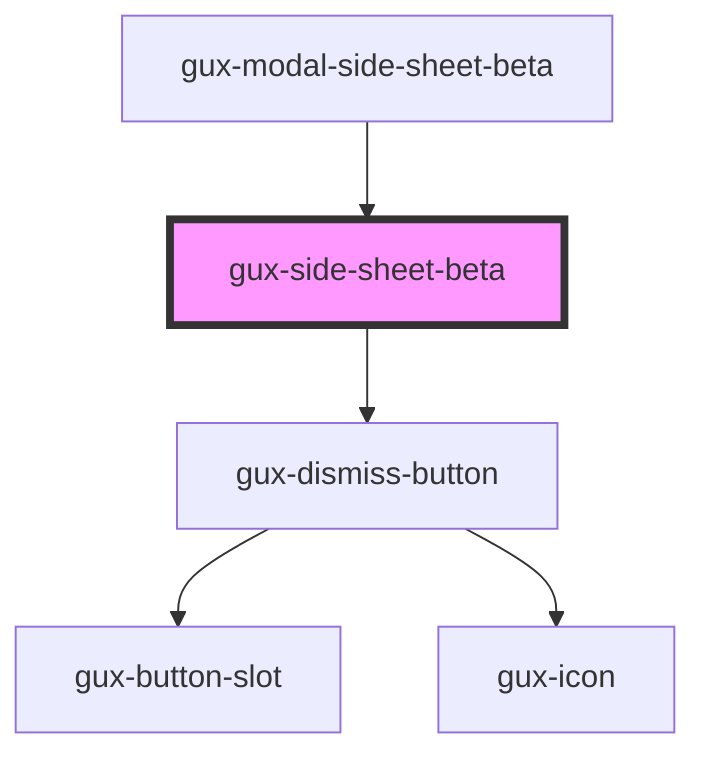

# gux-side-sheet-beta

<!-- Auto Generated Below -->

## Properties

| Property | Attribute | Description | Type                             | Default   |
| -------- | --------- | ----------- | -------------------------------- | --------- |
| `size`   | `size`    |             | `"large" \| "medium" \| "small"` | `'small'` |

## Events

| Event              | Description | Type                |
| ------------------ | ----------- | ------------------- |
| `sideSheetDismiss` |             | `CustomEvent<void>` |

## Dependencies

### Used by

 - [gux-modal-side-sheet-beta](.)

### Depends on

- [gux-dismiss-button](../../stable/gux-dismiss-button)

### Graph

----------------------------------------------

*Built with [StencilJS](https://stenciljs.com/)*
